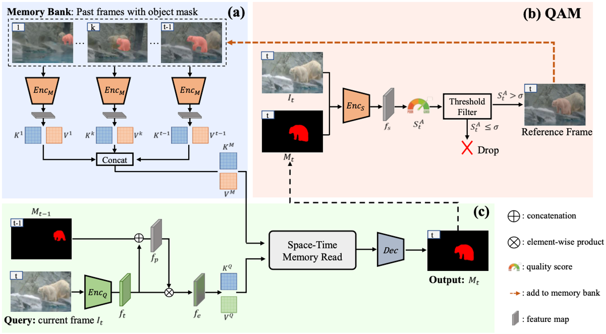
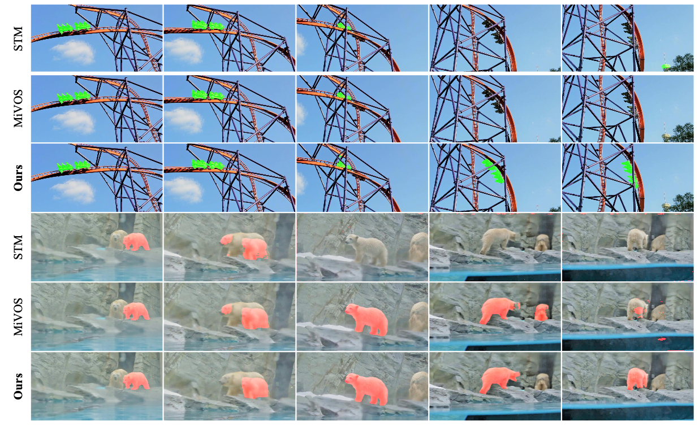
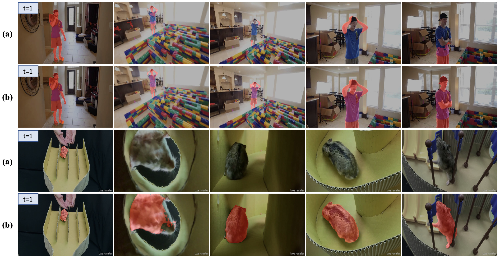

# Learning Quality-aware Dynamic Memory for Video Object Segmentation

*ECCV 2022*

## Abstract
Previous memory-based methods mainly focus on better matching between the current frame and the memory frames without explicitly paying attention to the quality of the memory. Therefore, frames with poor segmentation masks are prone to be memorized, which leads to a segmentation mask error accumulation problem and further affect the segmentation performance. In addition, the linear increase of memory frames with the growth of frame number also limits the ability of the models to handle long videos. To this end, we propose a Quality-aware Dynamic Memory Network (QDMN) to evaluate the segmentation quality of each frame, allowing the memory bank to selectively store accurately segmented frames to prevent the error accumulation problem. Then, we combine the segmentation quality with temporal consistency to dynamically update the memory bank to make the model have ability to hande videos of arbitray length.

## Framework
 

## Visualization Results
 

## Long Video Comparison
(a) is the results of retaining the most recent memory frames and (b) is applying our updating strategy.

 

## Results (S012)
| Dataset | Split |  J&F | J | F |
| --- | :---: | :--:|:--:|:---:|
| DAVIS 2016 | val | 92.0 | 90.7 | 93.2 |
| DAVIS 2017 | val | 85.6 | 82.5 | 88.6 |
| DAVIS 2017 | test-dev | 81.9 | 78.1 | 85.4 |

| Dataset | Split | Overall Score | J-Seen | F-Seen | J-Unseen | F-Unseen
| --- | --- | :--:|:--:|:---:|:---:|:---:|
| YouTubeVOS 18 | validation | 83.8 | 82.7 | 87.5 | 78.4 | 86.4 |
<!-- | YouTubeVOS 19 | validation | 84.2 | 82.6 | 87.0 | 79.4 | 87.7 | -->

## Pretrained Model
Please download the pretrained s012 model [here](https://drive.google.com/file/d/1fdiGFGol1ecVowPe6gfRHsRs9zCThFXB/view?usp=sharing).

## Requirements
<!-- Similar to the baseline method [STCN](https://github.com/hkchengrex/STCN),  -->
The following packages are used in this project.
- Pytorch  1.8.1 (or higher version)
- torchvision 0.9.1 (or higher version)
- opencv
- pillow
- progressbar2
- thinspline for training (https://github.com/cheind/py-thin-plate-spline)
- gitpython
- gdown

For installing Pytorch and torchvision, please refer to the official [guideline](https://pytorch.org/).

For others, you can install them by `pip install -r requirements.txt`.

## Data Preparation
Please refer to [MiVOS](https://github.com/hkchengrex/Mask-Propagation) to prepare the datasets and put all datasets in `/data`.

## Code Structure
```xml
├── data/: here are train and test datasets.
│   ├── static
│   ├── DAVIS
│   ├── YouTube
│   ├── BL30K
├── datasets/: transform and dataloader for train and test datasets
├── model/: here are the code of the network and training engine(model.py)
├── saves/: here are the checkpoint obtained from training
├── scripts/: some function used to process dataset
├── util/: here are the config(hyper_para.py) and some utils
├── train.py
├── inference_core.py: test engine for DAVIS
├── inference_core_yv.py: test engine for YouTubeVOS
├── eval_*.py
├── requirements.txt
```

## Training
### For pretraining:
To train on the static image datasets, use the following command:

`CUDA_VISIBLE_DEVICES=[GPU_ids] OMP_NUM_THREADS=4 python -m torch.distributed.launch --master_port [cccc] --nproc_per_node=GPU_num train.py --id [save_name] --stage 0`

For example, if we use 2 GPU for training and use 's0-QDMN' as ckpt name, the command is:

`CUDA_VISIBLE_DEVICES=0,1 OMP_NUM_THREADS=4 python -m torch.distributed.launch --master_port 12345 --nproc_per_node=2 train.py --id s0-QDMN --stage 0`

### For main training:
To train on DAVIS and YouTube, use this command:

`CUDA_VISIBLE_DEVICES=[GPU_ids] OMP_NUM_THREADS=4 python -m torch.distributed.launch --master_port [cccc] --nproc_per_node=GPU_num train.py --id [save_name] --stage 2 --load_network path_to_pretrained_ckpt`

Samely, if using 2 GPU, the command is:

`CUDA_VISIBLE_DEVICES=0,1 OMP_NUM_THREADS=4 python -m torch.distributed.launch --master_port 12345 --nproc_per_node=2 train.py --id s03-QDMN --stage 2 --load_network saves/s0-QDMN/**.pth`

### Resume training
Besides, if you want to resume interrupted training, you can run the command with `--load_model` and using the `*_checkpoint.pth`, for example:

`CUDA_VISIBLE_DEVICES=0,1 OMP_NUM_THREADS=4 python -m torch.distributed.launch --master_port 12345 --nproc_per_node=2 train.py --id s0-QDMN --stage 0 --load_model saves/s0-QDMN/s0-QDMN_checkpoint.pth`

## Inference
Run the following file to perform inference on the corresponding dataset.
- `eval_davis_2016.py`  used for DAVIS 2016 val set.
- `eval_davis.py`  used for DAVIS 2017 val and test-dev set (controlled by `--split`).
- `eval_youtube.py`  used for YouTubeVOS 2018/19 val and test set.


## Evaluation
For the evaluation metric on DAVIS 2016/2017 val set, we refer to the repository [DAVIS_val](https://github.com/workforai/DAVIS-evaluation).
For DAVIS 2017 test-dev set, you can get the metric results by submitting masks to the Codalab website [DAVIS_test](https://competitions.codalab.org/competitions/20516)
For YouTube2019 val set, please submit your results to [YouTube19](https://competitions.codalab.org/competitions/20127)
For YouTube2018 val set, please submit to [YouTube18](https://competitions.codalab.org/competitions/19544)


<!-- ## Citation
If you find this work useful for your research, please cite: -->


## Acknowledgement
Code in this repository is built upon several public repositories.
Thanks to 
[STCN](https://github.com/hkchengrex/STCN),
[MiVOS](https://github.com/hkchengrex/MiVOS),
[Mask Scoring RCNN](https://github.com/zjhuang22/maskscoring_rcnn)
for sharing their code.
